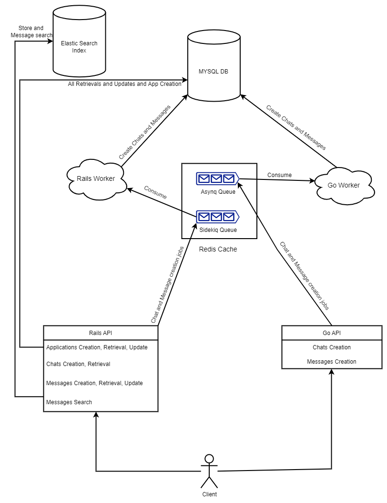
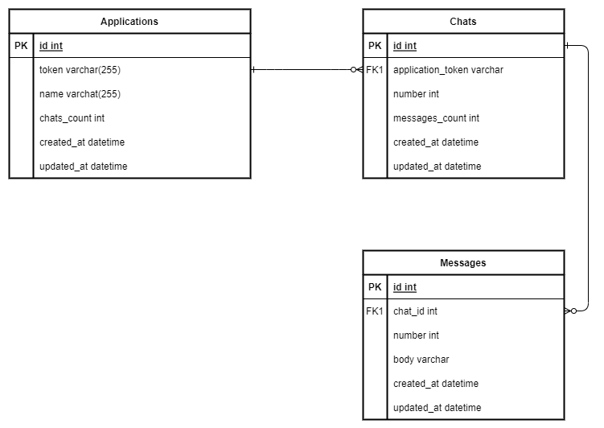

# Chat System

This is a chatting system that allows users to create Applications and receive application_token that uniquely identify the application so it can be used later to create chats and messages within that application. It also supports retrievals, updates and searching messages.

## Stack
* Ruby 2.6.10
* Rails 5.0.7
* Go 1.18.4
* Mysql 5.7
* Redis 6.2
* Elastic Search 7.17.1
* Docker 20.10.14

## Running the system
* You must have **Docker** installed.

* Clone the repo.

* Dockerized version
    
    * Run `docker-compose up`
* Locally

    * Run `docker-compose up -f docker-compose.Dev.yml`
    * Start rails server using `rails s`
    * Start go server using `go run api.go` within go-api directory

## System Design


## Database Schema
The database consists of 3 tables/models: Applications, Chats, and Messages.

* There is a one-to-many (1:N) relation between Applications and Chats .i.e Application may have many Chats.
* There is a one-to-many (1:N) relation between Chats and Messages .i.e Chat may have many Messages.



## Database Indices
* Applications Table

    * **Unique Secondary Index** on **token** column: to optimize application retrieval by its token.

* Chats Table

    * **Unique Composite Secondary Index** on **(application_token, number)** columns respectively to optimize:
        
        1- Retrieving all chats using only **application_token**.

        2- Retrieving a certain chat using both **application_token and chat_number**.

* Messages Table

    * **Unique Composite Secondary Index** on **(chat_id, number)** columns respectively to optimize:
        
        1- Retrieving all messages of a certain chat using only **chat_id**.

        2- Retrieving a certain message using both **chat_id and message_number**.

## Endpoints
***Note***: Kindly note that there is no API Gateway for the time being so you will have to send your requests to either one of the backend APIs directly.
    
* Rails API lives on localhost:3000
* Go API lives on localhost:8000

***Note***: I opted to implement API versioning to further extend the learning experience.

### Applications

#### Retrieve all applications
    GET /api/v1/applications
#### Retrieve a certain application
    GET /api/v1/applications/:token
#### Create an application
*Note*: a request body containing 'name' field is expected.

    POST /api/v1/applications
#### Update an application
*Note*: a request body containing 'name' field should exist.

    PUT /api/v1/applications/:token

### Chats

#### Retrieve all chats of a certain application
    GET /api/v1/applications/:application_token/chats
#### Retrieve a certain chat within a certain application
    GET /api/v1/applications/:application_token/chats/:number
#### Create a chat for a certain application (Available in both Rail API and GO API )

    POST /api/v1/applications/:application_token/chats
#### Delete a chat for a certain application

    DELETE /api/v1/applications/:application_token/chats/:number

### Messages

#### Retrieve all messages of a certain chat
    GET /api/v1/applications/:application_token/chats/:chat_number/messages
#### Retrieve a certain message of a certain chat
    GET /api/v1/applications/:application_token/chats/:chat_number/message/:number
#### Create a message for a certain chat (Available in both Rail API and GO API )
*Note*: a request body containing 'body' field is expected.

    POST /api/v1/applications/:application_token/chats/:chat_number/message
#### Update a message for a certain chat
*Note*: a request body containing 'body' field should exist.

    PUT /api/v1/applications/:application_token/chats/:chat_number/message/:number
#### Delete a message for a certain chat

    DELETE /api/v1/applications/:application_token/chats/:chat_number/message/:number
#### Search for messages within a certain chat
*Note*: a request body containing 'query' field is expected.

    POST /api/v1/applications/:application_token/chats/:chat_number/message/search

## Race Conditions and Concurrency Control
Since concurrent requests are allowed, this can lead to race conditions that might violate the app constraints.

* **Number issue**: In this API, chats and messages creation needs a number that is generated by the system for that chat or message i.e. a counter-like mechanism. Using a counter that isn't thread-safe such as a local variable or a database column may lead to race conditions i.e. two chats -within the same application- or two messages -within the same chat- may get the same number which violates the app logic.

    * Solution: Creating a thread-safe counter using **Redis**. Since **Redis** is single-threaded, which is how every command is guaranteed to be atomic. While one command is executing, no other command will run.

* **Resources that have connection pools**: The Go app has access to mysql DB and redis which use connection pools. If the application has many Go routines, it wouldn't make sense to create a new connection object, in fact this might cause connection pool exhaustion.
    * Solution: Make the connection objects **Singleton**
    using **sync** package.

## Queuing System
* I opted to use **Redis** to store the queues containing jobs to be processed later asynchronously.

* I used **Sidekiq** workers for background-tasks processing in Rails API. It is responsible for:
    
    * Pulling jobs from the corresponding queue in Redis.
    * Processing chats and messages creation jobs.
    * Scheduling tasks for updating chats and messages counters using **cron-jobs** that run periodically.

* I have also used **Asynq** in Go API which is very similar to Sidekiq for chats and messages creation background-tasks.

## Elastic Search
I used Elastic Search for partial-text matching and fuzzy  matching for typo-tolerence.
```
....
match: {
    body: {
        query: "*#{query}*",
        fuzziness: "AUTO"
    }
}
...
```
## Specs
I used **Rspec** to write the code specs for controllers and models. They can be found under 'spec' folder.
## TODOs
* Build API Gateway to sit between the client and the backend APIs.